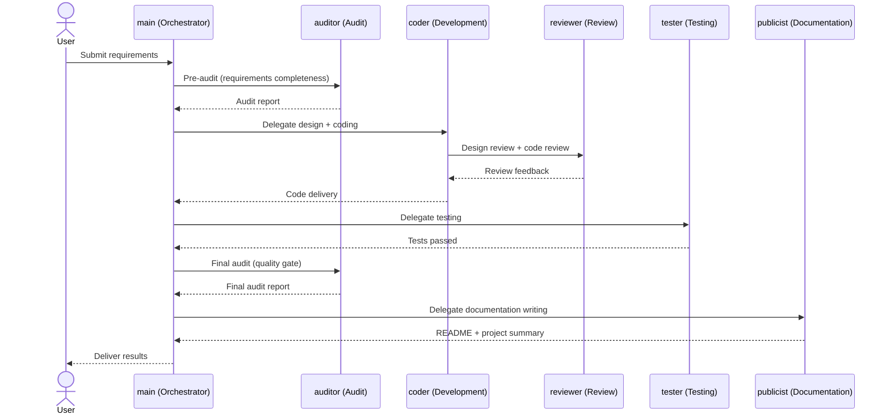

# SETUP.md — MA Team Understanding & Configuration Guide

> This document helps you understand the design philosophy and architecture of MA, so you can reproduce the MA development team in any environment.
>
> **This is not a script. It's a manual.** Understand it first, then configure. Don't aim for an exact copy.

---

## ⚡ 5-Minute Quick Setup

**Just want to get it running fast? Copy-paste these 4 commands, then say one sentence.**

```bash
# 1. Create agents
openclaw agents create coder    --workspace ~/.openclaw/workspace-coder
openclaw agents create reviewer --workspace ~/.openclaw/workspace-reviewer
openclaw agents create tester   --workspace ~/.openclaw/workspace-tester
openclaw agents create auditor  --workspace ~/.openclaw/workspace-auditor
openclaw agents create publicist --workspace ~/.openclaw/workspace-publicist

# 2. Set up projects sharing
for agent in coder reviewer tester auditor publicist; do
  ln -s ~/.openclaw/workspace/projects ~/.openclaw/workspace-$agent/projects
done
```

**3. Tell main:**
> Study `SETUP.md`, then merge and sync each agent's AGENTS.md and SOUL.md for coder, reviewer, tester, auditor, and publicist.

**4. Verify (tell main):**
> Team R&D: verify configuration, check that each agent is ready.

Done. Want to understand why it's designed this way? Read on.

---

## Philosophy: Why This Design

### Whatever a human team has, MA has

A reliable software development team needs at least these roles:

| Role | Responsibility | Why It's Essential |
|------|----------------|-------------------|
| **Tech Lead** | Requirements analysis, design decisions, quality gate | Without a gatekeeper, quality is left to chance |
| **Developer** | Architecture design, writing code | This is the output layer |
| **Tester** | Functional verification, bug discovery | Developers testing their own code have blind spots |
| **Auditor/QA** | Independent review, security checks | Both dev and test may miss things — a third-party perspective is needed |
| **Documentation Writer** | README, technical docs, summaries | Code that runs ≠ code that's deliverable |
| **Code Reviewer** | Code quality review, pair programming navigation | An independent pair of eyes between dev and test |

MA maps these six roles to six AI agents, each focused on one thing.

### Core Design Principles

1. **Separation of concerns.** Each agent only does what it's good at. The coder doesn't test, the tester doesn't audit, the auditor doesn't write code.
2. **Independent perspective.** The auditor doesn't participate in development, maintaining third-party objectivity. This is far more effective than "the same agent in a different mode."
3. **Single human-machine interface.** The user only talks to main. Main handles scheduling — the user doesn't need to know how many agents are working behind the scenes.
4. **Filesystem is the communication bus.** All agents share the `projects/` directory. Code, docs, and audit reports all live in the filesystem — no message queues or APIs needed.
5. **Trust but verify.** Main trusts the agents' capabilities, but every key output must be reviewed.

---

## Architecture Overview



**Communication method:** `sessions_send` (inter-agent messaging) + shared filesystem (`projects/` directory) + Git (code version control)

**Workflow (enhanced, incorporating spec-kit):**
```
0 constitution → 1 spec → 2 pre-audit+clarify → 3 gate → 4 design
→ 5 analyze → 6 implement → 7 test → 8 final-audit+checklist
→ 9 merge → 10 docs → 11 review
```

---

## Configuration Guide

### 1. Agent Creation

Each agent needs an independent workspace so their AGENTS.md and SOUL.md don't interfere with each other.

```bash
openclaw agents create coder    --workspace ~/.openclaw/workspace-coder
openclaw agents create reviewer --workspace ~/.openclaw/workspace-reviewer
openclaw agents create tester   --workspace ~/.openclaw/workspace-tester
openclaw agents create auditor  --workspace ~/.openclaw/workspace-auditor
openclaw agents create publicist --workspace ~/.openclaw/workspace-publicist
```

The main agent is your default agent (workspace at `~/.openclaw/workspace`). No extra creation needed. The reviewer must be created independently.

### 2. Critical Configuration: Projects Sharing

**This is the most error-prone step.** Agent workspaces are independent, but the `projects/` directory must be shared.

Core principle: the `projects/` directory seen by all agents must be the same directory (the `projects/` under the main workspace). This way, files written by agent A can be read directly by agent B.

Implementation — symbolic links:

```bash
for agent in coder reviewer tester auditor publicist; do
  ln -s ~/.openclaw/workspace/projects ~/.openclaw/workspace-$agent/projects
done
```

**Why symlinks and not other approaches?**
- Copying: files fall out of sync between agents — A's changes are invisible to B
- Git clone per agent: each agent has an independent repo — conflicts and sync become a nightmare
- Shared filesystem: the simplest solution — zero configuration, zero latency

### 4. Inter-Agent Communication

Enable agent-to-agent communication in the OpenClaw configuration:

```yaml
agents:
  tools:
    agentToAgent:
      enabled: true
      allow: [main, coder, reviewer, tester, auditor, publicist]
```

Communication matrix:
- main ↔ all agents (main is the scheduling hub)
- coder ↔ reviewer (pair programming + design review + code review loop)
- coder ↔ tester (bug fix loop)
- auditor ↔ main (audit result reporting; does not directly command coder/tester)
- publicist ↔ main (writing task reception and delivery)

### 5. Initialization: Merging Behavioral Guidelines into Each Agent Workspace

This is the most critical step in configuration. After main studies SETUP.md, it must not only understand the project but also **merge and sync each role's AGENTS.md and SOUL.md templates into the respective agent's workspace**.

#### Core Principle: Merge, Don't Overwrite

Each agent's AGENTS.md and SOUL.md is divided into two zones:

- **MA Core Zone** — wrapped by `<!-- MA:CORE_START -->` and `<!-- MA:CORE_END -->` markers. These are rules uniformly managed by the MA framework, ensuring team collaboration consistency.
- **Custom Zone** — the free area outside the markers. Agents record notes, preferences, lessons learned, and personal habits here. **This content belongs to the agent and must not be touched during initialization.**

On first initialization, the agent's workspace may not have these files yet — simply write them directly. But **on subsequent updates**, you must only replace the content between the MA:CORE markers, preserving everything the agent has accumulated outside them.

#### Operation Flow

**Step 1: Main studies the project**

Main reads the following files to gain a comprehensive understanding of the MA framework:

- `projects/ma/SETUP.md` — this document, understanding architecture and configuration
- `projects/ma/README.md` — team overview, quick start
- `projects/ma/multi-agent-design.md` — architecture design: agent design, communication matrix, three-document system, configuration reference
- `skills/team-dev/SKILL.md §2 RSF` — sequence diagrams: full flow interaction sequences, with todo.md and journey.md running throughout
- `skills/SKILL.md` — team R&D execution flow

**Step 2: Main merges AGENTS.md**

For each agent (coder, reviewer, tester, auditor, publicist), main performs:

1. Read `projects/ma/<agent>/AGENTS.md` — this is the role template
2. Send it to the corresponding agent via `sessions_send`, with a message like:

   > Please merge the following AGENTS.md template into your workspace.
   > - If your workspace already has AGENTS.md: only update the content between `<!-- MA:CORE_START -->` and `<!-- MA:CORE_END -->`, leaving custom content outside the markers intact
   > - If no AGENTS.md exists yet: write it directly
   > - Reply to confirm once done

3. The agent receives it and performs the merge operation in its own workspace (e.g., `~/.openclaw/workspace-coder/AGENTS.md`)
4. The agent replies to main confirming completion

**Step 3: Main merges SOUL.md**

The process is the same as AGENTS.md, but requires extra care:

- SOUL.md records the agent's persona. Agents accumulate unique personality and experience through long-term work.
- First initialization: write the template content directly
- Subsequent updates: only sync new personality traits from the template. **Never overwrite personalized content the agent has already accumulated.**
- If the agent has already developed its own understanding and expression of its persona, main should respect and preserve it.

**Step 4: Verification**

Main confirms with each agent one by one:

> Please read your AGENTS.md and SOUL.md, and confirm that the MA:CORE zones have been correctly synced and custom content is intact.

Each agent replies to confirm. Initialization is complete.

This design ensures: framework rules evolve uniformly, agent personalization is continuously preserved — both run in parallel without conflict.

---

## New Project Startup Flow

When you say "Team R&D" to main, main executes the following complete flow:

### Prerequisite: Understanding the Project

Main reads the following files to understand its own role and process:
- `projects/ma/main/SOUL.md` — orchestrator persona
- `projects/ma/main/AGENTS.md` — orchestrator behavioral guidelines
- `skills/SKILL.md` — execution flow

### Project Kickoff

1. Main creates the project constitution based on `projects/ma/main/constitution-template.md`
2. Creates the project directory structure (`src/`, `tests/`, `docs/`, etc.)
3. Git init

### Development Flow (incorporating spec-kit essence)

```
0 constitution — project constitution, non-negotiable principles
1 spec — requirements specification + code style
2 pre-audit + clarify — audit requirements completeness + identify ambiguities
3 main gate — review audit quality, decide whether to proceed
4 design — coder designs architecture plan
5 analyze — cross-document consistency check (spec ↔ design ↔ constitution)
6 implement — coder writes code
7 test — tester performs black-box + white-box testing
8 final-audit + checklist — final audit + generate quality checklist for item-by-item verification
9 merge — main merges code
10 docs — publicist writes README + project summary
11 review — main final review → notify user
```

Each phase produces clear documentation (constitution.md → spec.md → audit-report.md → design.md → checklist.md → README.md), forming a complete project archive.

---

## File Index

| File | Location | Purpose |
|------|----------|---------|
| Architecture Design | `projects/ma/multi-agent-design.md` | Agent design, communication matrix, three-document system, configuration reference |
| Full Flow Sequence Diagram | `skills/team-dev/SKILL.md §2 RSF` | Interaction sequences, todo.md and journey.md running throughout |
| Team Overview | `projects/ma/README.md` | Quick start |
| This Document | `projects/ma/SETUP.md` | Understanding, deployment & configuration guide |
| Main Behavioral Guidelines | `projects/ma/main/AGENTS.md` | Team R&D standards |
| Main Persona | `projects/ma/main/SOUL.md` | Triple identity definition |
| Task Board Template | `projects/ma/main/todo-template.md` | WBS + breakpoint resume |
| Process Log Template | `projects/ma/main/journey-template.md` | Todo mirror + closed-loop sub-patterns |
| Constitution Template | `projects/ma/main/constitution-template.md` | Project constitution |
| Team R&D Skill | `skills/SKILL.md` | Execution flow |
| Coder Guidelines | `projects/ma/coder/AGENTS.md` | Behavioral standards |
| Reviewer Guidelines | `projects/ma/reviewer/AGENTS.md` | Behavioral standards |
| Tester Guidelines | `projects/ma/tester/AGENTS.md` | Behavioral standards + defect template |
| Auditor Guidelines | `projects/ma/auditor/AGENTS.md` | Behavioral standards + issue management template |
| Publicist Guidelines | `projects/ma/publicist/AGENTS.md` | Behavioral standards |

---

## Minimum Viable Configuration

If you don't want to set up the full 4-agent team, main can fall back to single-agent mode, handling all roles itself.

Just ensure:
- The main agent is configured and running normally
- `skills/SKILL.md` exists
- `projects/ma/main/AGENTS.md` and `SOUL.md` exist

Main will detect whether other agents are available and automatically fall back when they're not.

---

*"Imitation is the sincerest form of flattery, but understanding is the deepest form of absorption."*
