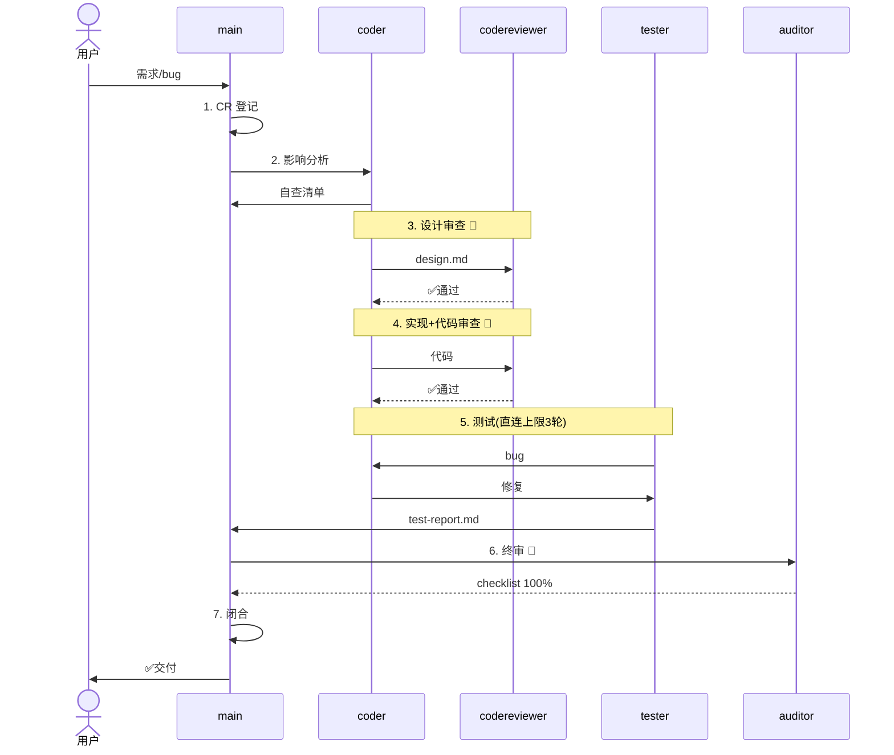

# 变更管理规范 — Change Management

> 版本: v1.0 | 生效日期: 2026-06-08
>
> 适用对象：main、coder、codereviewer、tester、auditor、publicist
>
> 核心理念借用《原则》（Ray Dalio）：**疼痛+反思=进步**，**不容忍两次同样的错误**。
> 每个变更不是只改代码，也是改进流程的机会。

---

## 目录

1. [变更管理总则](#1-变更管理总则)
2. [变更生命周期](#2-变更生命周期)
3. [变更请求（CR）模板](#3-变更请求cr模板)
4. [影响分析自查清单](#4-影响分析自查清单)
5. [核心文件修改规则](#5-核心文件修改规则)
6. [跨模块数据变换规范](#6-跨模块数据变换规范)
7. [非阻塞问题追踪规则](#7-非阻塞问题追踪规则)
8. [角色互换常态化](#8-角色互换常态化)
9. [Agent 故障冗余策略](#9-agent-故障冗余策略)
10. [变更与标准流程的映射](#10-变更与标准流程的映射)
11. [附录：变更历史](#11-附录变更历史)

---

## 1. 变更管理总则

### 1.1 什么是"变更"

在 MA 框架中，"变更"指团队研发模式下**对已有代码库的任何修改**，包括：

| 变更类型 | 示例 | 典型流程 |
|---------|------|---------|
| 🆕 **新增功能** | 在现有代码上叠加新能力 | M/L 级标准流程 |
| 🐛 **修复缺陷** | 修复 tester 或用户发现的 bug | S/M 级流程 |
| 🔧 **重构优化** | 不改变行为的内部重写 | M 级标准流程 |
| 📐 **设计调整** | 接口变更、数据模型修改 | M/L 级标准流程 |
| 📝 **文档更新** | README、注释、设计文档 | S 级流程 |
| 🔀 **需求变更** | 开发中用户需求发生变化 | 走 delta 变更流程 |

### 1.2 变更管理核心原则

1. **每个变更都必须有 CR（Change Request 变更请求）。** 哪怕是 1 行的 bugfix 也要做影响评估。没有 CR 的变更不进入开发。
2. **每个变更必须做影响分析。** 修改前问"改了什么"、"影响了什么"、"会坏什么"。
3. **影响大的变更必须在 design.md 中给出数据变换示例。** 跨模块的数据格式变换是最高风险点。
4. **核心文件修改必须走 coder。** main 不直接修改超过 500 行的核心文件。
5. **审查发现的问题必须追踪。** 即使不阻塞合入，也要记入 todo.md 的"待修复"清单。
6. **Agent 必须有冗余机制。** 主 agent 不可用时自动降级到备用。

### 1.3 术语表

| 术语 | 含义 |
|------|------|
| CR | Change Request，变更请求 |
| 变更基线 | 变更前代码库的状态（git diff 基准） |
| 影响范围 | 变更涉及的文件、模块、数据流的集合 |
| 回归风险 | 变更可能破坏已有功能的风险等级 |
| 数据变换 | 数据在模块间传递时格式/结构的变化点 |
| 核心文件 | 超过 500 行的核心逻辑文件（主 handler、store、server 等） |
| delta 变更 | 在已有变更基础上追加的修改，不覆盖原变更 |

---

## 2. 变更生命周期

### 基础时序（Mermaid）



### 各阶段参数

每个阶段由触发条件驱动，执行行动，产出交付物，通过门禁后才能进入下一阶段。

```json
{
  "lifecycle": [
    {
      "id": 1, "name": "CR登记", "owner": "main",
      "trigger": "用户提出需求 / 发现 bug / 需变更",
      "actions": ["登记 CR：编号、类型、摘要、优先级", "评估复杂度(S/M/L)"],
      "branches": null,
      "output": "docs/CR.md",
      "gate": "无 CR 不得开发"
    },
    {
      "id": 2, "name": "影响分析", "owner": "coder→main",
      "trigger": "CR 登记完成",
      "actions": ["coder 填写 10 项自查清单", "main 审核"],
      "branches": [
        "跨模块数据变换→design.md 给≥2组示例",
        "核心文件修改→走 coder",
        "范围大→走 M/L 级流程"
      ],
      "output": "CR.md 影响分析列 + 自查清单",
      "gate": "main 审核通过"
    },
    {
      "id": 3, "name": "设计审查", "owner": "coder→codereviewer",
      "trigger": "design.md 完成",
      "actions": ["审查变更兼容性", "验证数据变换示例", "检查边界覆盖"],
      "branches": [
        "通过→编码",
        "退回→coder 修改 design 后重审",
        "设计争议→升级 main"
      ],
      "output": "docs/design.md（追加变更说明）",
      "gate": "codereviewer 🔴"
    },
    {
      "id": 4, "name": "实现+审查", "owner": "coder→codereviewer",
      "trigger": "设计审查通过",
      "actions": ["feature 分支实现（commit 注明 CR 编号）", "codereviewer 代码审查"],
      "branches": ["通过→测试", "退回→修复→重审(上限 2轮)", "超限→升级 main"],
      "output": "代码 commit + docs/code-review-report.md",
      "gate": "codereviewer 🔴"
    },
    {
      "id": 5, "name": "测试", "owner": "tester+coder(直连)",
      "trigger": "代码审查通过",
      "actions": ["保留原测试用例，追加变更用例", "delta 回归测试（全量）", "发现 bug→coding 直连修复"],
      "branches": ["全部通过→终审", "超限 3轮→main 介入裁决"],
      "output": "docs/test-report.md",
      "gate": "通过率=100%，无 P0/P1 bug"
    },
    {
      "id": 6, "name": "终审", "owner": "auditor",
      "trigger": "测试通过",
      "actions": ["生成 checklist", "对照 git diff 追溯", "检查回归破坏 + 非阻塞问题"],
      "branches": ["通过→闭合", "退回→逐项修复→重审"],
      "output": "docs/checklist.md + docs/audit-report.md",
      "gate": "checklist 100% 🔴"
    },
    {
      "id": 7, "name": "闭合", "owner": "main",
      "trigger": "终审通过",
      "actions": ["git merge", "更新 VERSION/CHANGELOG（注明 CR）", "标记 CR closed", "更新 journey.md"],
      "branches": null,
      "output": "合并 commit + CHANGELOG 更新",
      "gate": "CR 已闭合"
    }
  ]
}
```
- 变更必须走 feature 分支，不与 main 分支直接混合
- git commit 注明 CR 编号（如 `feat: 用户认证 #CR-003`）
- codereviewer 重点关注：变更与已有代码的边界处理、数据泄露、竞态条件

**交付物：** 代码 commit + `docs/code-review-report.md`

### 阶段 5：测试（tester + coder）

**标准流程阶段7。**

**变更场景下的特殊要求：**
- 保留所有原有测试用例，追加变更相关用例
- 至少覆盖：功能正确性 + 边界条件 + 回归测试（变更不破坏已有功能）
- ✅ **delta 回归测试**：原有测试用例全量跑一遍，确认无破坏
- test-report.md 中注明变更测试摘要

**交付物：** `docs/test-report.md`

### 阶段 6：终审（auditor）

**标准流程阶段8。**

**变更场景下的特殊要求：**
- auditor 生成项目特定的 checklist
- checklist 必须包含回归破坏检查项
- 对照变更基线（git diff）追溯，确认变更覆盖了 CR 中所有需求
- 非阻塞问题（codereviewer/tester 发现但不立即需要修复的）→ 记入 todo.md"待修复"清单

**交付物：** `docs/checklist.md` + `docs/audit-report.md`

### 阶段 7：闭合（main）

1. main 确认所有条件满足后 git merge
2. 更新版本号
3. 更新 CHANGELOG.md，注明 CR 编号
4. 在 `docs/CR.md` 标记变更完成
5. 更新 `docs/journey.md`

**交付物：** git merge + CHANGELOG 更新 + CR 闭合

---

## 3. 变更请求（CR）模板

CR 记录在 `docs/CR.md` 文件中，按顺序追加。

### CR 记录格式

```markdown
## CR-001 — [变更标题]

| 字段 | 内容 |
|------|------|
| **登记时间** | YYYY-MM-DD HH:MM |
| **类型** | `feature` / `bugfix` / `refactor` / `design-change` / `docs` |
| **优先级** | `P0-阻断` / `P1-重要` / `P2-一般` / `P3-建议` |
| **变更范围** | S / M / L（按代码量/文件数/跨模块数综合评估） |
| **摘要** | 一句话描述变更内容和目标 |
| **关联CR** | 如有依赖或被依赖的 CR 编号 |
| **状态** | `open` → `impact-analysis` → `design-review` → `implementing` → `testing` → `auditing` → `closed` |

### 详细描述

变更的具体内容，包括：
- 做什么
- 不做什么（非目标）
- 验收标准

### 影响分析

| 维度 | 评估 |
|------|------|
| 涉及文件 | ... |
| 涉及模块 | ... |
| 核心文件（>500行） | 是/否 — 文件名 |
| 跨模块数据变换 | 是/否 — 描述 |
| 安全敏感 | 是/否 |
| 回归风险 | 高/中/低 |
| **自查清单** | 见 [docs/change-management.md §4](change-management.md) |

### 设计审查结论

| 审查人 | 结论 | 时间 |
|--------|------|------|
| codereviewer | ✅ 通过 / 🔴 退回 / ⏸ 有条件（问题见下） | YYYY-MM-DD HH:MM |

### 测试摘要

| 项目 | 数据 |
|------|------|
| 新增用例数 | ... |
| 回归用例数 | ... |
| 通过率 | ... |
| 增量覆盖率 | ... |

### 终审结论

| 审查人 | 结论 | 时间 |
|--------|------|------|
| auditor | ✅ 通过 / 🔴 退回 | YYYY-MM-DD HH:MM |

### 闭合记录

- **闭合时间：** YYYY-MM-DD HH:MM
- **合并分支：** feature/xxx → main
- **版本号：** vX.Y.Z
- **CHANGELOG 条目：** [链接或摘要]
```

### 小型变更简化模板（S 级）

对于 S 级变更（1 行 bugfix、简单文档更新），使用简化版：

```markdown
## CR-002 — [标题]

- **类型/优先级：** bugfix / P0
- **摘要：** fix: 空指针 when input is null
- **影响范围：** 单文件（src/util.py:45-52），无跨模块数据变换
- **自查清单：** 全部 N/A
- **状态：** `closed` ✅
```

---

## 4. 影响分析自查清单

> 🔴 **每个变更前必须填写。** coder 在阶段4（设计）时完成，main 在阶段3（gate check）审核。
>
> 规则：
> - S 级变更可以口头回答，但每个问题必须过一遍
> - M/L 级变更必须写到 design.md 或 CR.md 中
> - 任一问题答案为"是" → 涉及的风险点必须在 design.md 中展开说明

```json
{
  "impactChecklist": [
    {"id": 1, "question": "是否修改了核心文件（>500行）？", "actionIfYes": "核心文件仅允许 coder 编辑，main 不直接修改", "risk": "core"},
    {"id": 2, "question": "是否涉及跨模块的数据格式/路径变换？", "actionIfYes": "design.md 给出输入→输出示例（≥2组）", "risk": "data"},
    {"id": 3, "question": "是否跨模块？（修改了 2+ 模块间的接口/调用关系）", "actionIfYes": "codereviewer 设计审查重点检查数据流", "risk": "cross"},
    {"id": 4, "question": "是否有跨技术栈的数据交互？", "actionIfYes": "序列化/反序列化边界最容易出错", "risk": "serialize"},
    {"id": 5, "question": "是否有竞态条件风险？", "actionIfYes": "写清楚锁策略或不可变设计", "risk": "concurrency"},
    {"id": 6, "question": "是否涉及文件 IO 或网络 IO？", "actionIfYes": "超时控制、错误重试、资源释放", "risk": "io"},
    {"id": 7, "question": "是否修改了配置文件/环境变量/启动参数？", "actionIfYes": "同步更新相关部署文档", "risk": "config"},
    {"id": 8, "question": "是否新增了外部依赖？", "actionIfYes": "design.md 中给出选型理由", "risk": "dependency"},
    {"id": 9, "question": "是否会影响已存在的测试用例？", "actionIfYes": "增量追加用例，不删除原有用例", "risk": "test"},
    {"id": 10, "question": "是否涉及安全敏感操作？", "actionIfYes": "auditor 终审重点检查", "risk": "security"}
  ]
}
```

### 示例
| 1 | 修改核心文件？ | 是 | server.py (1200行) — 新增消息路由端点 |
| 2 | 跨模块数据变换？ | 是 | channel_service 内部消息格式 → HTTP JSON API |
| 3 | 跨模块？ | 是 | controller → service → dao 三层调用 |
| 4 | 技术栈交互？ | 否 | 纯后端变更 |
| 5 | 竞态条件？ | 否 | 无状态接口，请求独立处理 |
| 6 | 文件/网络 IO？ | 是 | 新增 HTTP 出站调用—需设超时 |
| 7 | 配置变更？ | 是 | 新增 message_channel.timeout_ms 配置项 |
| 8 | 外部依赖？ | 否 | 使用已有 HTTP 客户端 |
| 9 | 影响现有测试？ | 是 | TestServer 需追加消息通道集成测试 |
| 10 | 安全敏感？ | 否 | 内部服务通信，无外部暴露 |
```

---

## 5. 核心文件修改规则

### 5.1 定义

核心文件指同时满足以下条件的文件：
- **行数 > 500 行**
- **属于核心业务逻辑**（非配置文件、测试文件、文档）
- **被 2+ 个模块引用**

典型的超过 500 行的核心文件：主 handler、store、server、核心服务类。

### 5.2 修改规则

| 操作 | main | coder |
|------|------|-------|
| 直接编辑核心文件（>500行） | ❌ 🔴 **禁止** | ✅ 可以 |
| 设计变更方案 | ✅ 决策 | ✅ 执行 |
| 审查核心文件变更 | ✅ 审查 | — |
| Edit / write 工具适用范围 | ✅ 配置文件、测试文件、文档、小型工具脚本（<500行） | 全部 |

> **操作范围说明：** Edit 和 write 两个工具同等对待——main 不得用任意一种修改核心文件（>500行）的方法体。
> 但允许 main 在核心文件中修改 import 行、常量定义等不会破坏逻辑结构的行级变更。

### 5.3 核心文件变更流程

当变更涉及核心文件时，流程不同于普通变更：

| 步骤 | 行动 | 交付物 | 审查重点 |
|------|------|-------|---------|
| 1. main 识别 | 发现变更涉及核心文件 → `sessions_send coder:"CR-xxx 涉及核心文件，请设计方案并实现"` | — | — |
| 2. coder 设计 | 设计方案 → 写入 design.md | design.md（变更部分） | 变更的精准性、最小影响范围 |
| 3. codereviewer 设计审查 | 审查 design.md 中的变更方案 | 审查结论 | 是否破坏了原有逻辑、是否插入了不应修改的方法体中间 |
| 4. coder 实现 | 在核心文件中做最小精准变更，不改变文件结构 | 代码（feature 分支） | 只改必须改的部分 |
| 5. codereviewer 代码审查 | 审查实现代码 | code-review-report.md | 变更边界清晰、不破坏原有结构 |
| 6. tester 测试 | 回归测试（重点：确认原有功能无损） | test-report.md | 全量测试通过，核心文件原有功能无退化 |
| 7. auditor 终审 | 对照 git diff 逐行审查变更部分 | audit-report.md | 变更范围精确，无意外内容 |

### 5.4 禁止的行为

- ❌ main 用 edit 工具修改大型核心文件的方法体（Edit 工具不适合精细修改长文件内部结构）
- ❌ 在不理解核心文件全貌的情况下做局部修改
- ❌ 没做回归测试就合入核心文件变更
- ❌ coder 自审自改（核心文件变更必须由 codereviewer 审查）

---

## 6. 跨模块数据变换规范

### 6.1 定义

"数据变换"（Data Transformation）指数据在模块间传递时发生的**格式、结构、语义的变化**。

### 6.2 高风险数据变换场景

| 场景 | 典型错误 | 说明 |
|------|---------|------|
| 数据拼接 | 拼接后的语义不符合设计预期 | 多段数据组合时语义边界混淆 |
| ID 映射 | 用错键查表 | 不同模块使用不同的标识字段名 |
| 序列化/反序列化 | 字段丢失或异常 | JSON/YAML/Protobuf 转换时遗漏可选字段 |
| 类型转换 | 精度或范围丢失 | 高精度→低精度类型转换截断 |
| 聚合计算 | 口径不一致 | 同一指标在不同模块计算方式不同（含/不含已删除、含/不含缓存等） |
| 枚举映射 | 值缺失 | 源枚举值在目标模块没有对应项 |

### 6.3 规范要求

**对于每个涉及跨模块数据变换的变更，coder 必须在 design.md 中提供：**

1. **至少 2 组输入→输出示例**（涵盖正常情况和边界情况）
2. **数据变换的形式化描述**（自然语言或伪代码）
3. **关键字段的映射关系**（从源到目标的每个字段是怎么来的）
4. **异常情况的处理约定**（输入不符合预期时，返回错误还是降级）

**豁免条件：** 当数据变换仅包含直接赋值（字段名 1:1 映射且无任何转换逻辑）时，可仅提供 1 组示例，并在 design.md 中注明"直接映射，无变换逻辑"。codereviewer 在审查时确认豁免是否合理。

### 6.4 design.md 数据变换章节模板

```markdown
## 数据变换设计

### 变换描述
<!-- 一句话说明数据从哪里来到哪里去 -->

### 输入/输出示例

#### 示例 1：正常情况
```
输入:  {"id": 1, "name": "张三", "role": "admin"}
输出: {"user_id": 1, "display": "张三(管理员)", "level": 10}
变换逻辑: role="admin" → display 追加"(管理员)"，level 从配置表查角色等级
```

#### 示例 2：边界情况（角色未配置等级）
```
输入:  {"id": 2, "name": "李四", "role": "guest"}
输出: {"user_id": 2, "display": "李四(访客)", "level": 0}
变换逻辑: guest 角色不在等级配置中 → level 默认 0
```

#### 示例 3：异常情况（必填字段缺失）
```
输入:  {"id": 3, "name": "王五"}
输出: 必须约定返回错误还是降级处理
变换逻辑: role 字段缺失 → 约定：返回 400 错误？还是默认 role="user"？
```

### 关键字段映射

| 源字段 | 目标字段 | 变换规则 | 示例 |
|--------|---------|---------|------|
| `user.id` | `output.user_id` | 直接赋值 | 1 → 1 |
| `user.name`+`user.role` | `output.display` | name + role 映射文案拼接 | "张三"+"admin" → "张三(管理员)" |
| `user.role` → 查配置表 | `output.level` | 查 role_level 配置表 | "admin" → 10 |

### 异常处理

| 异常场景 | 处理方式 |
|---------|---------|
| role 字段为 null | 默认 "user" 角色，level=1 |
| role 不在配置表中 | level=0，日志警告 |
| 必填字段缺失 | 返回 400 错误 + 字段名 |
```

### 6.5 审查守则

- codereviewer 设计审查（阶段4b）必须**逐组验证**数据变换示例
  - 手算一遍：输入 → 预期输出，检查变换逻辑是否一致
  - 检查示例是否覆盖了边界情况
  - 发现遗漏 → 退回 coder 补充
- 编码实现后，coder 应写**针对数据变换的专项测试**（覆盖所有示例）
- 数据变换是回归测试的核心——任何无关变更都不应改变变换结果

---

## 7. 非阻塞问题追踪规则

### 7.1 什么是非阻塞问题

非阻塞问题指 codereviewer 或 tester 在审查/测试中发现，但**不影响当前合入**的问题：
- 当前版本不会触发（边界条件）
- 性能损耗可接受（少量额外调用）
- 属于代码异味但不涉及安全或正确性

### 7.2 追踪规则

审查/测试发现非阻塞问题后，按以下逻辑判断：

| 条件 | 行动 |
|------|------|
| 影响正确性？→ **是** | 升级为阻塞（标记 Critical 或 High），必须修复后合入 |
| 影响正确性？→ **否** | 标记为非阻塞，记录到 todo.md 待修复章节 |

todo.md 待修复条目格式：

| # | 登记时间 | 来源 | 问题描述 | CR关联 | 优先级 |
|---|---------|------|---------|-------|--------|
| TD-1 | YYYY-MM-DD | codereviewer | 匿名回调影响可读性，建议命名 | CR-002 | P3 |
| TD-2 | YYYY-MM-DD | tester | 大数据量加载超过 3 秒 | CR-002 | P3 |

### 7.3 非阻塞问题的处理

| 优先级 | 含义 | 处理时限 |
|--------|------|---------|
| P2 | 当前版本建议修复 | 下次同模块变更时顺手修 |
| P3 | 无实际影响 | 积累 5 个以上时安排专项修复 |

### 7.4 禁止的行为

- ❌ "算了" 或 "下次改" 口头约定 — 必须记入 todo.md
- ❌ 在修复前关闭 CR — 非阻塞问题 = 开放技术债务
- ❌ 把非阻塞问题和阻塞问题混在一起 — 各自独立追踪
- ❌ 非阻塞问题无人认领 — 必须由 main 指定修复计划

---

## 8. 角色互换常态化

### 8.1 策略

**每 3 个 Sprint 或每次大版本（MINOR 级别）更新时，至少安排一次角色互换。**

### 8.2 互换方式

| 互换 | 效果 |
|------|------|
| coder ↔ codereviewer | coder 审查，codereviewer 编码 | 发现 coder 视角看不清的问题；codereviewer 编码更注意审查要点 |
| coder → tester | coder 执行一次完整测试 | 理解测试视角，编写更可测试的代码 |
| coder → navigator | coder 作为导航员指导 codereviewer | 锻炼设计表达能力 |

### 8.3 互换触发

```markdown
### YYYY-MM-DD [main] 角色互换安排

- Sprint N+1 安排角色互换
- CR-010 ~ CR-012 由 codereviewer 编码，coder 审查
- 互换结束后的复盘：双方写下收获
```

### 8.4 互换期间的审查要求

- 互换不降低审查标准。codereviewer 作为代码作者同样要通过对方的审查
- 互换周期内发现的问题同等追踪

---

## 9. Agent 故障冗余策略

### 9.1 原则

任何 Agent（tester、auditor、coder 等）在主模型不可用时，应有自动降级机制。

### 9.2 降级策略

| 触发条件 | 处理 |
|---------|------|
| 主模型报错（余额不足、服务不可用、认证失败） | main 使用备用模型重新 spawn agent |
| 主模型响应超时（>60s 无回复） | main 使用备用模型重新 spawn |
| 备用模型也失败 | 告知用户当前 agent 不可用，建议手动处理或等待恢复 |

### 9.3 main 的检测处理流程

| 触发 | 条件 | 行动 |
|------|------|------|
| `sessions_spawn [agent]` 失败 | 错误是 balance不足/超时/服务不可用 | 切备用模型重试一次 |
| 备用模型也失败 | — | 告知用户：手动执行 或 等待模型恢复 |

### 9.4 journey.md 记录示例

```markdown
### HH:MM [main] [agent名] 降级
- primary model 不可用（insufficient balance）
- switched to fallback model ✅
- 已告知用户，不影响当前进度
```

---

## 10. 变更与标准流程的映射

### 10.1 变更类型 → 推荐流程

| 变更类型 | 推荐流程 | 特殊要求 |
|---------|---------|---------|
| 🆕 新增功能 | M 级 / L 级 | CR 登记 + 完整影响分析 |
| 🐛 修复缺陷 | S 级 / M 级 | CR 登记（简化版）+ 自查清单 + 回归测试 |
| 🔧 重构优化 | M 级 | CR 登记 + 影响分析 + 完整回归测试 |
| 📐 设计调整 | M 级 / L 级 | CR 登记 + 核心文件规则 |
| 📝 文档更新 | S 级 | CR 登记（简化版） |
| 🔀 需求变更 | delta 流程 | CR 登记 + 最大继承原则 |

### 10.2 变更范围判断速查

| 条件（三者全部满足走该级） | 复杂度 |
|---------------------------|--------|
| 文件=1 且 非核心文件 且 无跨模块 | S 级 |
| 文件≤5 且 无核心文件 且 模块≤2 | M 级 |
| 文件>5 或 涉及核心文件 或 模块≥3 | L 级 |

**规则：** 以最高维度为准。不确定时默认取高一级。

### 10.3 变更在标准流程中的 Agent 职责矩阵

| 标准阶段 | 变更管理职责 | 负责角色 |
|---------|-------------|---------|
| 阶段0 (复杂度评估) | 评估变更复杂性，声明流程 | main |
| 阶段1 (spec) | 登记 CR，填写详细描述 | main |
| 阶段2 (前置审计) | 审计 CR 的完整性、歧义 | auditor |
| 阶段3 (gate check) | 审核影响分析自查清单 | main |
| 阶段4 (design) | 填写自查清单；涉及跨模块数据变换的写示例 | coder |
| 阶段4b (设计审查) | 审查数据变换示例，验证影响分析 | codereviewer |
| 阶段5 (analyze) | 检查 CR 与现有系统的一致性 | main |
| 阶段6 (实现) | 最小化、精准修改，git commit 注明 CR 编号 | coder |
| 阶段6b (代码审查) | 审查变更与已有代码的边界 | codereviewer |
| 阶段7 (测试) | delta 回归测试，非阻塞问题记入 todo.md | tester |
| 阶段8 (终审) | 对照 CR 逐项验证，回归破坏检查 | auditor |
| 阶段9 (merge) | 更新 VERSION、CHANGELOG（注明 CR 编号）、CR 闭合 | main |

### 10.4 变更质量门禁（逐项确认，缺一不可）

```json
{
  "qualityGates": [
    {"id": 1, "check": "CR 已登记（docs/CR.md）", "approvedBy": "auditor(阶段8)", "when": "终审"},
    {"id": 2, "check": "影响分析自查清单已填写", "approvedBy": "auditor(阶段8)", "when": "终审"},
    {"id": 3, "check": "（如涉及核心文件）走 coder 实现，main 未直接编辑", "approvedBy": "auditor(阶段8)", "when": "终审"},
    {"id": 4, "check": "（如涉及跨模块数据变换）design.md 已给出示例", "approvedBy": "auditor(阶段8)", "when": "终审（前提：codereviewer 已审）"},
    {"id": 5, "check": "codereviewer 已审查设计", "approvedBy": "auditor(阶段8)", "when": "流程合规检查"},
    {"id": 6, "check": "codereviewer 已审查代码", "approvedBy": "auditor(阶段8)", "when": "流程合规检查"},
    {"id": 7, "check": "非阻塞问题已记入 todo.md", "approvedBy": "auditor(阶段8)", "when": "终审"},
    {"id": 8, "check": "delta 回归测试通过", "approvedBy": "auditor(阶段8)", "when": "终审"},
    {"id": 9, "check": "auditor 终审通过", "approvedBy": "main(阶段9)", "when": "闭合前"},
    {"id": 10, "check": "CHANGELOG 已更新（注明 CR 编号）", "approvedBy": "main(阶段9)", "when": "闭合"},
    {"id": 11, "check": "CR 已闭合", "approvedBy": "main(阶段9)", "when": "闭合"}
  ]
}
```

---

## 11. 自我改进机制

> 借鉴《原则》（Ray Dalio）的核心方法论：**疼痛+反思=进步**（Pain + Reflection = Progress）
> 将每一次问题、违规、失败转化为系统改进的燃料，不容忍两次同样的错误。

### 11.1 基本信念

MA 框架从《原则》中吸收了以下理念：

```json
{
  "principles": [
    {"name": "激进的事实性", "essence": "直面问题，不回避", "maMapping": "CR/红线违反/bug逃逸公开记录到 journey.md"},
    {"name": "不容忍同错", "essence": "允许犯错，不容忍罔顾教训、一错再错", "maMapping": "第一次=学习机会，第二次=系统漏洞，第三次=流程缺陷"},
    {"name": "机器化管理", "essence": "设计系统，不是靠人治", "maMapping": "问题→问流程而不是问责个人"},
    {"name": "五步流程法", "essence": "目标→问题→诊断→方案→执行", "maMapping": "复盘按五步结构输出"},
    {"name": "可信度决策", "essence": "可信度加权", "maMapping": "codereviewer/auditor 审查结论权重更高"}
  ]
}
```

### 11.2 疼痛→反思→进步闭环

**核心公式：**

| 步骤 | 行动 | 位置/工具 |
|------|------|---------|
| 1. 疼痛 | 问题发生、违规触发、bug 逃逸 | 任意 |
| 2. 记录 | 记录到 journey.md（不涂改、不掩盖） | journey.md |
| 3. 诊断 | 追问根因：为什么发生？系统中哪个环节允许了？ | 诊断三问（见下文） |
| 4. 修复 | 改流程 / 改规范 / 改工具（不只是改代码） | change-management.md / 规范文件 |
| 5. 验证 | 确认修复闭环：该问题不再出现 | 下一次相关场景 |
| 6. 沉淀 | 更新 change-management.md 或流程文档 | change-management.md / 规范文件 |

**触发条件：**

| 触发事件 | 最低回应级别 |
|---------|------------|
| 红线违反 | 触发后再发生 → 升级为流程缺陷 → 修改 change-management.md |
| 同一类型 bug 逃逸到用户 ≥ 2 次 | 根因分析 → 修改流程或测试规范 |
| codereviewer 重复发现同一类问题 ≥ 3 次 | coder 技能缺陷 → 补充训练或加自动检查 |
| tester 模型连续失败 ≥ 2 次 | 不够冗余 → 补充备用模型或通知策略 |
| auditor 终审发现流程跳过 | 触发后再发生 → 流程缺陷 → 强制门禁 |

#### 诊断三问（任何问题必问）

遇到问题（红线违反、bug 逃逸、流程跳过、模型故障），不急着改代码。先问三个问题：

1. **这个问题暴露了流程中的什么漏洞？** 
   → 例如：codereviewer 跳过了设计审查 → 暴露了"设计审查非门禁"的漏洞
2. **这个根因是在哪一层？**（个人层 / 流程层 / 规范层 / 工具层）
   → 个人层：技能不足 → 需要训练
   → 流程层：流程允许了违规 → 需要加门禁
   → 规范层：规范没说清楚 → 需要明确约定
   → 工具层：工具没有提供支撑 → 需要改进工具
3. **我们怎么确认修复了？**
   → 下次同样场景下，这个错误不会发生 → 定义验证标准

**禁止的行为：**
- ❌ 只修症状不改根因 — "这个 bug 修好了"然后下次同类型再来
- ❌ 归因于个人 — "某 agent 没做好"不是根因，"流程允许他跳过"才是
- ❌ 修了一次就不管了 — 同类问题出现 2 次必须升级为流程级改进

### 11.3 不容忍两次同样的错误

**追踪机制：**

```
docs/
├── CR.md             ← 变更请求（一次性的）
├── recurring-issues.md  ← 重复性问题追踪（新增）
```

`recurring-issues.md` 格式：

```markdown
# 重复性问题追踪

> 记录已出现 ≥ 2 次的问题。每次出现都加深一次根因分析，直到找到流程级修复方案。

| # | 问题模式 | 首次出现 | 最近出现 | 出现次数 | 当前根因假设 | 修复状态 |
|---|---------|---------|---------|---------|------------|---------|
| R1 | 核心文件被 main 直接 edit 导致结构损坏 | 2026-06-01 | 2026-06-06 | 2 | 流程没有显式禁止 main edit 核心文件 | 已加固：change-management.md §5 |
| R2 | 跨模块数据变换未给出示例导致编码偏误 | 2026-06-05 | 2026-06-06 | 2 | design.md 模板缺少数据变换章节 | 已加固：change-management.md §6 |
```

**规则：**
- 第一次出现：journey.md 记录
- 第二次出现：写入 recurring-issues.md，标记为"重复"
- 第三次出现：必须做流程级修复，写入 change-management.md 或相关规范

### 11.4 五步复盘法（基于《原则》5-Step Process）

每次复盘（项目结束 / 重大变更 / 红线违反），按五步输出：

```
Step 1: 目标 — 本次要达成什么？（回顾原始目标）
Step 2: 问题 — 实际发生了什么？什么阻碍了目标达成？（只列事实，不含判断）
Step 3: 诊断 — 根因是什么？系统允许了什么？（追问至少 3 层 why）
Step 4: 方案 — 怎么改流程/规范/工具？（不只改代码；方案必须有验证标准）
Step 5: 执行 — 谁改？改什么？什么时候完成？（可追踪的行动项）
```

模板：

```markdown
## 复盘记录 — [项目/事件名称]

| 步骤 | 内容 |
|------|------|
| 1. 目标 | 原始目标描述 |
| 2. 问题 | 现象 + 影响 + 发生频率 |
| 3. 诊断 | 根因追问链路（Why × 3）：
|        | 1. 为什么出问题？→ ...
|        | 2. 为什么系统中允许了它？→ ...
|        | 3. 为什么没有在更早的阶段拦截？→ ... |
| 4. 方案 | 修复方案 + 验证标准 |
| 5. 执行 | 行动项（负责人 + 截止时间） |
```

### 11.5 流程健康度巡检

**每季度一次**（或每次大版本更新前），main 执行流程健康度巡检：

| 指标 | 含义 | 健康阈值 |
|------|------|---------|
| 红线违反率 | 每个 Sprint 内红线违反次数 | ≤ 1 次/Sprint |
| 重复问题率 | 同一模式问题出现 ≥ 2 次的数量 | = 0（出现即修复流程）|
| CR 登记率 | 变更中登记 CR 的比例 | = 100% |
| 自查清单完成率 | 变更前填写影响分析的比例 | ≥ 90% |
| bug 逃逸率 | 经完整流程后仍有 bug 到达用户 | ≤ 5% |
| 复盘完成率 | 每次变更后复盘的完成比例 | ≥ 80% |

**巡检输出：** 写入 `docs/process-health.md`

健康度不达标 → 根因分析 → 修改 change-management.md 或相关流程

### 11.6 自我改进 vs 问责

| ❌ 问责思维 | ✅ 改进思维 |
|-----------|-----------|
| 这谁搞的？ | 流程中哪个环节允许了这个问题？ |
| 下次注意点 | 下次怎么系统性地防止？ |
| 扣分 / 惩罚 | 补充规范 / 加门禁 |
| 修完就完了 | 修完还要确认同类问题不会再来 |

---

## 附录A：变更历史

| 版本 | 日期 | 变更 |
|------|------|------|
| v1.0 | 2026-06-08 | 初版 |
