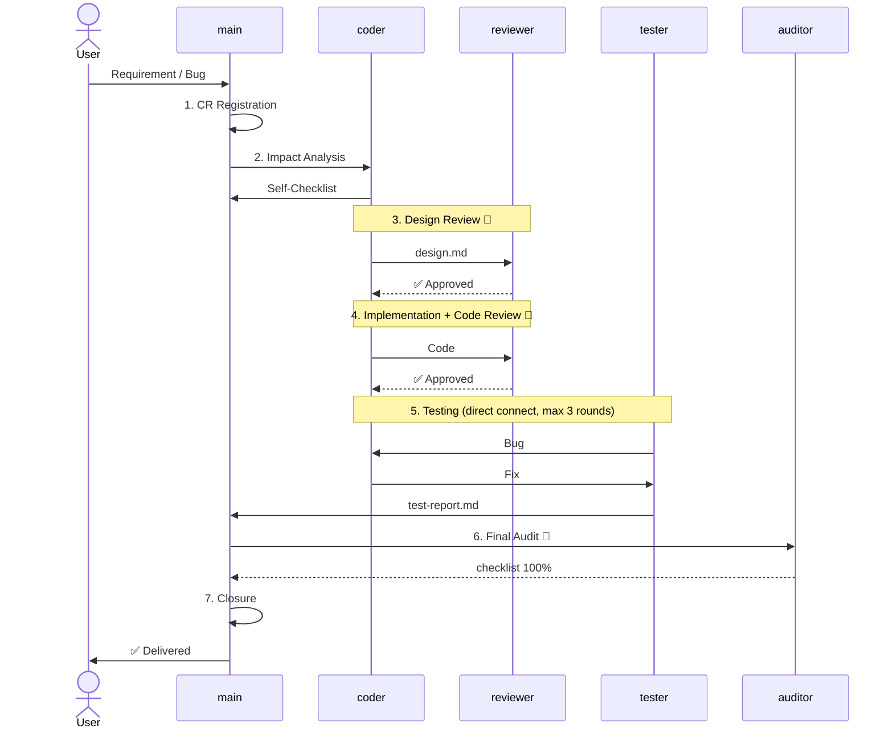

# Change Management Specification

> Version: v1.0 | Effective Date: 2026-06-08
>
> Applicable to: main, coder, reviewer, tester, auditor, publicist
>
> Core philosophy borrowed from *Principles* (Ray Dalio): **Pain + Reflection = Progress**, **Don’t tolerate the same mistake twice**.
> Every change is not just about fixing code — it's an opportunity to improve the process.

---

## Table of Contents

1. [Change Management General Rules](#1-change-management-general-rules)
2. [Change Lifecycle](#2-change-lifecycle)
3. [Change Request (CR) Template](#3-change-request-cr-template)
4. [Impact Analysis Self-Checklist](#4-impact-analysis-self-checklist)
5. [Core File Modification Rules](#5-core-file-modification-rules)
6. [Cross-Module Data Transformation Specification](#6-cross-module-data-transformation-specification)
7. [Non-Blocking Issue Tracking Rules](#7-non-blocking-issue-tracking-rules)
8. [Role Rotation Normalization](#8-role-rotation-normalization)
9. [Agent Failure Redundancy Strategy](#9-agent-failure-redundancy-strategy)
10. [Mapping Changes to Standard Process](#10-mapping-changes-to-standard-process)
11. [Self-Improvement Mechanism](#11-self-improvement-mechanism)
12. [Appendix: Change History](#appendix-change-history)

---

## 1. Change Management General Rules

### 1.1 What Is a "Change"

In the MA framework, a "change" refers to **any modification to the existing codebase** in team development mode, including:

| Change Type | Example | Typical Process |
|-------------|---------|-----------------|
| 🆕 **New Feature** | Adding new capabilities on top of existing code | M/L-level standard process |
| 🐛 **Bug Fix** | Fixing a bug found by tester or user | S/M-level process |
| 🔧 **Refactoring** | Internal rewrite without behavioral change | M-level standard process |
| 📐 **Design Adjustment** | Interface changes, data model modifications | M/L-level standard process |
| 📝 **Documentation Update** | README, comments, design docs | S-level process |
| 🔀 **Requirement Change** | User requirements change during development | Delta change process |

### 1.2 Core Principles of Change Management

1. **Every change must have a CR (Change Request).** Even a 1-line bugfix requires an impact assessment. No development begins without a CR.
2. **Every change must undergo impact analysis.** Before modifying, ask: "What changed?", "What is affected?", "What could break?".
3. **High-impact changes must provide data transformation examples in design.md.** Cross-module data format transformations are the highest-risk points.
4. **Core file modifications must go through coder.** main does not directly modify core files exceeding 500 lines.
5. **Issues found during review must be tracked.** Even if they don't block merging, they must be recorded in the todo.md "To Fix" list.
6. **Agents must have redundancy mechanisms.** Automatically degrade to fallback when the primary agent is unavailable.

### 1.3 Glossary

| Term | Meaning |
|------|---------|
| CR | Change Request |
| Change Baseline | The state of the codebase before the change (git diff baseline) |
| Impact Scope | The set of files, modules, and data flows affected by the change |
| Regression Risk | The risk level that the change may break existing functionality |
| Data Transformation | Points where data format/structure changes when passing between modules |
| Core File | Core logic files exceeding 500 lines (main handler, store, server, etc.) |
| Delta Change | Additional modifications applied on top of an existing change, not overwriting the original change |

---

## 2. Change Lifecycle

### Basic Sequence (Mermaid)



### Stage Parameters

Each stage is driven by trigger conditions, executes actions, produces deliverables, and passes through gates before proceeding to the next stage.

```json
{
  "lifecycle": [
    {
      "id": 1, "name": "CR Registration", "owner": "main",
      "trigger": "User submits requirement / bug discovered / change needed",
      "actions": ["Register CR: number, type, summary, priority", "Assess complexity (S/M/L)"],
      "branches": null,
      "output": "docs/CR.md",
      "gate": "No development without a CR"
    },
    {
      "id": 2, "name": "Impact Analysis", "owner": "coder→main",
      "trigger": "CR registration complete",
      "actions": ["coder fills out 10-item self-checklist", "main reviews"],
      "branches": [
        "Cross-module data transformation → provide ≥2 example sets in design.md",
        "Core file modification → go through coder",
        "Large scope → use M/L-level process"
      ],
      "output": "CR.md impact analysis section + self-checklist",
      "gate": "main review approved"
    },
    {
      "id": 3, "name": "Design Review", "owner": "coder→reviewer",
      "trigger": "design.md completed",
      "actions": ["Review change compatibility", "Validate data transformation examples", "Check boundary coverage"],
      "branches": [
        "Approved → coding",
        "Returned → coder revises design, re-review",
        "Design dispute → escalate to main"
      ],
      "output": "docs/design.md (appended change description)",
      "gate": "reviewer 🔴"
    },
    {
      "id": 4, "name": "Implementation + Review", "owner": "coder→reviewer",
      "trigger": "Design review approved",
      "actions": ["Implement on feature branch (commit references CR number)", "reviewer code review"],
      "branches": ["Approved → testing", "Returned → fix → re-review (max 2 rounds)", "Exceeded → escalate to main"],
      "output": "Code commit + docs/code-review-report.md",
      "gate": "reviewer 🔴"
    },
    {
      "id": 5, "name": "Testing", "owner": "tester+coder (direct connect)",
      "trigger": "Code review approved",
      "actions": ["Retain original test cases, add change-specific cases", "Delta regression testing (full suite)", "Bug found → coding direct fix"],
      "branches": ["All passed → final audit", "Exceeded 3 rounds → main intervention"],
      "output": "docs/test-report.md",
      "gate": "Pass rate = 100%, no P0/P1 bugs"
    },
    {
      "id": 6, "name": "Final Audit", "owner": "auditor",
      "trigger": "Testing passed",
      "actions": ["Generate checklist", "Trace against git diff", "Check regression damage + non-blocking issues"],
      "branches": ["Approved → closure", "Returned → fix item by item → re-audit"],
      "output": "docs/checklist.md + docs/audit-report.md",
      "gate": "checklist 100% 🔴"
    },
    {
      "id": 7, "name": "Closure", "owner": "main",
      "trigger": "Final audit approved",
      "actions": ["git merge", "Update VERSION/CHANGELOG (reference CR)", "Mark CR as closed", "Update journey.md"],
      "branches": null,
      "output": "Merge commit + CHANGELOG update",
      "gate": "CR closed"
    }
  ]
}
```
- Changes must use feature branches; do not mix directly with the main branch
- git commit must reference the CR number (e.g., `feat: user authentication #CR-003`)
- reviewer focuses on: boundary handling between change and existing code, data leaks, race conditions

**Deliverable:** code commit + `docs/code-review-report.md`

### Stage 5: Testing (tester + coder)

**Standard process Stage 7.**

**Special requirements for change scenarios:**
- Retain all original test cases, add change-related cases
- At minimum cover: functional correctness + boundary conditions + regression testing (change does not break existing functionality)
- ✅ **Delta regression testing**: Run the full original test suite to confirm no damage
- Note the change testing summary in test-report.md

**Deliverable:** `docs/test-report.md`

### Stage 6: Final Audit (auditor)

**Standard process Stage 8.**

**Special requirements for change scenarios:**
- auditor generates project-specific checklist
- Checklist must include regression damage check items
- Trace against the change baseline (git diff) to confirm the change covers all CR requirements
- Non-blocking issues (found by reviewer/tester but not immediately requiring fix) → record in todo.md "To Fix" list

**Deliverable:** `docs/checklist.md` + `docs/audit-report.md`

### Stage 7: Closure (main)

1. main confirms all conditions are met, then git merge
2. Update version number
3. Update CHANGELOG.md, referencing the CR number
4. Mark change complete in `docs/CR.md`
5. Update `docs/journey.md`

**Deliverable:** git merge + CHANGELOG update + CR closed

---

## 3. Change Request (CR) Template

CRs are recorded in the `docs/CR.md` file, appended in order.

### CR Record Format

```markdown
## CR-001 — [Change Title]

| Field | Content |
|-------|---------|
| **Registration Time** | YYYY-MM-DD HH:MM |
| **Type** | `feature` / `bugfix` / `refactor` / `design-change` / `docs` |
| **Priority** | `P0-Blocker` / `P1-Critical` / `P2-Normal` / `P3-Suggestion` |
| **Change Scope** | S / M / L (comprehensive assessment by code volume / file count / cross-module count) |
| **Summary** | One-line description of change content and goal |
| **Related CR** | Dependent or depending CR numbers, if any |
| **Status** | `open` → `impact-analysis` → `design-review` → `implementing` → `testing` → `auditing` → `closed` |

### Detailed Description

Specific content of the change, including:
- What to do
- What not to do (non-goals)
- Acceptance criteria

### Impact Analysis

| Dimension | Assessment |
|-----------|-----------|
| Files Involved | ... |
| Modules Involved | ... |
| Core Files (>500 lines) | Yes/No — file name |
| Cross-Module Data Transformation | Yes/No — description |
| Security Sensitive | Yes/No |
| Regression Risk | High/Medium/Low |
| **Self-Checklist** | See [docs/change-management.md §4](change-management.md) |

### Design Review Conclusion

| Reviewer | Conclusion | Time |
|----------|-----------|------|
| reviewer | ✅ Approved / 🔴 Returned / ⏸ Conditional (issues below) | YYYY-MM-DD HH:MM |

### Testing Summary

| Item | Data |
|------|------|
| New Test Cases | ... |
| Regression Test Cases | ... |
| Pass Rate | ... |
| Incremental Coverage | ... |

### Final Audit Conclusion

| Auditor | Conclusion | Time |
|---------|-----------|------|
| auditor | ✅ Approved / 🔴 Returned | YYYY-MM-DD HH:MM |

### Closure Record

- **Closure Time:** YYYY-MM-DD HH:MM
- **Merged Branch:** feature/xxx → main
- **Version:** vX.Y.Z
- **CHANGELOG Entry:** [link or summary]
```

### Simplified Template for Small Changes (S-Level)

For S-level changes (1-line bugfix, simple documentation update), use the simplified version:

```markdown
## CR-002 — [Title]

- **Type/Priority:** bugfix / P0
- **Summary:** fix: null pointer when input is null
- **Impact Scope:** Single file (src/util.py:45-52), no cross-module data transformation
- **Self-Checklist:** All N/A
- **Status:** `closed` ✅
```

---

## 4. Impact Analysis Self-Checklist

> 🔴 **Must be completed before every change.** coder completes it at Stage 4 (Design), main reviews at Stage 3 (Gate Check).
>
> Rules:
> - S-level changes may answer verbally, but every question must be considered
> - M/L-level changes must be written into design.md or CR.md
> - If any question answer is "Yes" → the associated risk point must be elaborated in design.md

```json
{
  "impactChecklist": [
    {"id": 1, "question": "Does it modify a core file (>500 lines)?", "actionIfYes": "Core files may only be edited by coder; main does not modify directly", "risk": "core"},
    {"id": 2, "question": "Does it involve cross-module data format/path transformation?", "actionIfYes": "Provide input→output examples (≥2 sets) in design.md", "risk": "data"},
    {"id": 3, "question": "Is it cross-module? (Modifies interfaces/call relationships between 2+ modules)", "actionIfYes": "reviewer design review focuses on data flow inspection", "risk": "cross"},
    {"id": 4, "question": "Is there cross-tech-stack data interaction?", "actionIfYes": "Serialization/deserialization boundaries are most error-prone", "risk": "serialize"},
    {"id": 5, "question": "Is there a race condition risk?", "actionIfYes": "Clearly document lock strategy or immutable design", "risk": "concurrency"},
    {"id": 6, "question": "Does it involve file I/O or network I/O?", "actionIfYes": "Timeout control, error retry, resource cleanup", "risk": "io"},
    {"id": 7, "question": "Does it modify config files / environment variables / startup parameters?", "actionIfYes": "Synchronously update related deployment docs", "risk": "config"},
    {"id": 8, "question": "Does it add external dependencies?", "actionIfYes": "Provide selection rationale in design.md", "risk": "dependency"},
    {"id": 9, "question": "Will it affect existing test cases?", "actionIfYes": "Incrementally add cases; do not delete original cases", "risk": "test"},
    {"id": 10, "question": "Does it involve security-sensitive operations?", "actionIfYes": "auditor focuses on this during final audit", "risk": "security"}
  ]
}
```

### Example
| 1 | Modify core file? | Yes | server.py (1200 lines) — new message routing endpoint |
| 2 | Cross-module data transformation? | Yes | channel_service internal message format → HTTP JSON API |
| 3 | Cross-module? | Yes | controller → service → dao three-layer calls |
| 4 | Tech stack interaction? | No | Pure backend change |
| 5 | Race conditions? | No | Stateless endpoint, requests processed independently |
| 6 | File/Network I/O? | Yes | New HTTP outbound call — needs timeout |
| 7 | Config change? | Yes | New message_channel.timeout_ms config item |
| 8 | External dependency? | No | Uses existing HTTP client |
| 9 | Affects existing tests? | Yes | TestServer needs message channel integration tests |
| 10 | Security sensitive? | No | Internal service communication, no external exposure |
```

---

## 5. Core File Modification Rules

### 5.1 Definition

Core files are files that simultaneously meet the following conditions:
- **Lines > 500 lines**
- **Belongs to core business logic** (not config files, test files, or documentation)
- **Referenced by 2+ modules**

Typical core files exceeding 500 lines: main handler, store, server, core service classes.

### 5.2 Modification Rules

| Operation | main | coder |
|-----------|------|-------|
| Directly edit core files (>500 lines) | ❌ 🔴 **Prohibited** | ✅ Allowed |
| Design change approach | ✅ Decision | ✅ Execution |
| Review core file changes | ✅ Review | — |
| Edit / write tool scope | ✅ Config files, test files, docs, small utility scripts (<500 lines) | All |

> **Scope clarification:** The Edit and write tools are treated equally — main must not use either to modify the method body of core files (>500 lines).
> However, main is allowed to modify import lines, constant definitions, and other line-level changes in core files that do not disrupt logical structure.

### 5.3 Core File Change Process

When a change involves core files, the process differs from ordinary changes:

| Step | Action | Deliverable | Review Focus |
|------|--------|-------------|-------------|
| 1. main identifies | Discovers change involves core file → `sessions_send coder:"CR-xxx involves core file, please design approach and implement"` | — | — |
| 2. coder designs | Design the approach → write to design.md | design.md (change section) | Precision of change, minimal impact scope |
| 3. reviewer design review | Review the change approach in design.md | Review conclusion | Whether original logic is broken, whether modifications are inserted inappropriately into method bodies |
| 4. coder implements | Make minimal, precise changes in core file without altering file structure | Code (feature branch) | Only change what must be changed |
| 5. reviewer code review | Review implementation code | code-review-report.md | Change boundaries are clear, original structure preserved |
| 6. tester tests | Regression testing (focus: confirm original functionality intact) | test-report.md | Full test suite passed, core file original functionality not degraded |
| 7. auditor final audit | Line-by-line review of changed portions against git diff | audit-report.md | Change scope is precise, no unintended content |

### 5.4 Prohibited Behaviors

- ❌ main using the edit tool to modify method bodies of large core files (Edit tool not suitable for fine modifications to long file internal structure)
- ❌ Making local changes without understanding the full picture of the core file
- ❌ Merging core file changes without regression testing
- ❌ coder self-reviewing own changes (core file changes must be reviewed by reviewer)

---

## 6. Cross-Module Data Transformation Specification

### 6.1 Definition

"Data Transformation" refers to **format, structure, or semantic changes** that occur when data passes between modules.

### 6.2 High-Risk Data Transformation Scenarios

| Scenario | Typical Error | Description |
|----------|--------------|-------------|
| Data Concatenation | Concatenated semantics don't match design expectations | Semantic boundary confusion when combining multiple data segments |
| ID Mapping | Wrong key used for table lookup | Different modules use different identifier field names |
| Serialization/Deserialization | Field loss or anomalies | Optional fields missed during JSON/YAML/Protobuf conversion |
| Type Conversion | Precision or range loss | Truncation when converting from high to low precision types |
| Aggregation Calculation | Inconsistent metrics | Same metric calculated differently across modules (with/without deleted items, with/without cache, etc.) |
| Enum Mapping | Missing values | Source enum value has no corresponding entry in target module |

### 6.3 Specification Requirements

**For every change involving cross-module data transformation, coder must provide in design.md:**

1. **At least 2 sets of input→output examples** (covering normal and boundary cases)
2. **Formal description of the data transformation** (natural language or pseudocode)
3. **Key field mapping relationships** (how each field from source maps to target)
4. **Exception handling conventions** (when input doesn't meet expectations, return error or degrade)

**Exemption conditions:** When the data transformation only involves direct assignment (field name 1:1 mapping with no transformation logic), only 1 example set is required, and "direct mapping, no transformation logic" must be noted in design.md. reviewer confirms the exemption is reasonable during review.

### 6.4 design.md Data Transformation Section Template

```markdown
## Data Transformation Design

### Transformation Description
<!-- One sentence describing where data comes from and where it goes -->

### Input/Output Examples

#### Example 1: Normal Case
```
Input:  {"id": 1, "name": "Zhang San", "role": "admin"}
Output: {"user_id": 1, "display": "Zhang San (Admin)", "level": 10}
Transformation Logic: role="admin" → display appends "(Admin)", level looked up from role config table
```

#### Example 2: Boundary Case (role not configured with level)
```
Input:  {"id": 2, "name": "Li Si", "role": "guest"}
Output: {"user_id": 2, "display": "Li Si (Guest)", "level": 0}
Transformation Logic: guest role not in level config → level defaults to 0
```

#### Example 3: Error Case (required field missing)
```
Input:  {"id": 3, "name": "Wang Wu"}
Output: Must decide: return error or degrade
Transformation Logic: role field missing → convention: return 400 error? or default role="user"?
```

### Key Field Mapping

| Source Field | Target Field | Transformation Rule | Example |
|-------------|-------------|--------------------|---------|
| `user.id` | `output.user_id` | Direct assignment | 1 → 1 |
| `user.name`+`user.role` | `output.display` | name + role mapping text concatenation | "Zhang San"+"admin" → "Zhang San (Admin)" |
| `user.role` → lookup config table | `output.level` | Look up role_level config table | "admin" → 10 |

### Exception Handling

| Exception Scenario | Handling Approach |
|-------------------|-------------------|
| role field is null | Default "user" role, level=1 |
| role not in config table | level=0, log warning |
| Required field missing | Return 400 error + field name |
```

### 6.5 Review Guidelines

- reviewer design review (Stage 4b) must **verify data transformation examples group by group**
  - Manually compute: input → expected output, check transformation logic consistency
  - Check whether examples cover boundary cases
  - If omissions found → return to coder for supplementation
- After implementation, coder should write **targeted tests for data transformation** (covering all examples)
- Data transformation is the core of regression testing — no unrelated change should alter transformation results

---

## 7. Non-Blocking Issue Tracking Rules

### 7.1 What Is a Non-Blocking Issue

Non-blocking issues are problems found by reviewer or tester during review/testing that **do not affect the current merge**:
- Won't trigger in the current version (boundary conditions)
- Performance overhead is acceptable (minor extra calls)
- Code smell but not involving security or correctness

### 7.2 Tracking Rules

After review/testing discovers a non-blocking issue, judge as follows:

| Condition | Action |
|-----------|--------|
| Affects correctness? → **Yes** | Escalate to blocking (mark Critical or High), must fix before merge |
| Affects correctness? → **No** | Mark as non-blocking, record in todo.md "To Fix" section |

todo.md "To Fix" entry format:

| # | Registration Time | Source | Issue Description | CR Reference | Priority |
|---|-------------------|--------|-------------------|-------------|----------|
| TD-1 | YYYY-MM-DD | reviewer | Anonymous callback affects readability, recommend naming | CR-002 | P3 |
| TD-2 | YYYY-MM-DD | tester | Large data volume loading exceeds 3 seconds | CR-002 | P3 |

### 7.3 Handling Non-Blocking Issues

| Priority | Meaning | Processing Deadline |
|----------|---------|-------------------|
| P2 | Recommended fix for current version | Fix alongside next change to the same module |
| P3 | No practical impact | Arrange dedicated fix when 5+ accumulated |

### 7.4 Prohibited Behaviors

- ❌ "Forget it" or "fix next time" verbal agreements — must be recorded in todo.md
- ❌ Closing CR before fixing — non-blocking issues = open technical debt
- ❌ Mixing non-blocking and blocking issues — track each independently
- ❌ Non-blocking issues unclaimed — main must designate a fix plan

---

## 8. Role Rotation Normalization

### 8.1 Strategy

**Every 3 Sprints or each major version (MINOR level) update, arrange at least one role rotation.**

### 8.2 Rotation Methods

| Rotation | Effect |
|----------|--------|
| coder ↔ reviewer | coder reviews, reviewer codes | Discover problems invisible from coder's perspective; reviewer coding better notes review points |
| coder → tester | coder performs one complete testing cycle | Understand testing perspective, write more testable code |
| coder → navigator | coder acts as navigator guiding reviewer | Exercise design communication skills |

### 8.3 Rotation Trigger

```markdown
### YYYY-MM-DD [main] Role Rotation Arrangement

- Sprint N+1 arranges role rotation
- CR-010 ~ CR-012: reviewer codes, coder reviews
- Post-rotation retrospective: both parties write down takeaways
```

### 8.4 Review Requirements During Rotation

- Rotation does not lower review standards. reviewer as code author must still pass the counterparty's review
- Issues found during rotation period are tracked equally

---

## 9. Agent Failure Redundancy Strategy

### 9.1 Principle

Any Agent (tester, auditor, coder, etc.) should have an automatic degradation mechanism when the primary model is unavailable.

### 9.2 Degradation Strategy

| Trigger Condition | Handling |
|-------------------|----------|
| Primary model error (insufficient balance, service unavailable, auth failure) | main respawns agent using fallback model |
| Primary model response timeout (>60s no reply) | main respawns using fallback model |
| Fallback model also fails | Notify user that current agent is unavailable, suggest manual handling or waiting for recovery |

### 9.3 main Detection Handling Process

| Trigger | Condition | Action |
|---------|-----------|--------|
| `sessions_spawn [agent]` fails | Error is insufficient balance/timeout/service unavailable | Switch to fallback model, retry once |
| Fallback model also fails | — | Notify user: execute manually or wait for model recovery |

### 9.4 journey.md Recording Example

```markdown
### HH:MM [main] [agent name] Degradation
- primary model unavailable (insufficient balance)
- switched to fallback model ✅
- user notified, current progress unaffected
```

---

## 10. Mapping Changes to Standard Process

### 10.1 Change Type → Recommended Process

| Change Type | Recommended Process | Special Requirements |
|-------------|-------------------|---------------------|
| 🆕 New Feature | M-level / L-level | CR registration + full impact analysis |
| 🐛 Bug Fix | S-level / M-level | CR registration (simplified) + self-checklist + regression testing |
| 🔧 Refactoring | M-level | CR registration + impact analysis + full regression testing |
| 📐 Design Adjustment | M-level / L-level | CR registration + core file rules |
| 📝 Documentation Update | S-level | CR registration (simplified) |
| 🔀 Requirement Change | Delta process | CR registration + maximum inheritance principle |

### 10.2 Change Scope Assessment Quick Reference

| Conditions (all three must be met for this level) | Complexity |
|---------------------------------------------------|-----------|
| Files = 1 AND not core file AND no cross-module | S-level |
| Files ≤ 5 AND no core file AND modules ≤ 2 | M-level |
| Files > 5 OR involves core file OR modules ≥ 3 | L-level |

**Rule:** Use the highest dimension. Default to one level higher when uncertain.

### 10.3 Agent Responsibility Matrix for Changes in Standard Process

| Standard Stage | Change Management Responsibility | Responsible Role |
|---------------|-------------------------------|-----------------|
| Stage 0 (Complexity Assessment) | Assess change complexity, declare process | main |
| Stage 1 (Spec) | Register CR, fill in detailed description | main |
| Stage 2 (Pre-Audit) | Audit CR completeness and ambiguity | auditor |
| Stage 3 (Gate Check) | Review impact analysis self-checklist | main |
| Stage 4 (Design) | Fill in self-checklist; provide examples for cross-module data transformation | coder |
| Stage 4b (Design Review) | Review data transformation examples, verify impact analysis | reviewer |
| Stage 5 (Analyze) | Check CR consistency with existing system | main |
| Stage 6 (Implementation) | Minimal, precise changes; git commit references CR number | coder |
| Stage 6b (Code Review) | Review boundaries between change and existing code | reviewer |
| Stage 7 (Testing) | Delta regression testing, record non-blocking issues in todo.md | tester |
| Stage 8 (Final Audit) | Verify against CR item by item, regression damage check | auditor |
| Stage 9 (Merge) | Update VERSION, CHANGELOG (reference CR number), CR closure | main |

### 10.4 Change Quality Gates (confirm each item; no omissions allowed)

```json
{
  "qualityGates": [
    {"id": 1, "check": "CR registered (docs/CR.md)", "approvedBy": "auditor (Stage 8)", "when": "Final Audit"},
    {"id": 2, "check": "Impact analysis self-checklist completed", "approvedBy": "auditor (Stage 8)", "when": "Final Audit"},
    {"id": 3, "check": "(If core file involved) Implemented via coder, main did not directly edit", "approvedBy": "auditor (Stage 8)", "when": "Final Audit"},
    {"id": 4, "check": "(If cross-module data transformation involved) Examples provided in design.md", "approvedBy": "auditor (Stage 8)", "when": "Final Audit (prerequisite: reviewer reviewed)"},
    {"id": 5, "check": "reviewer reviewed design", "approvedBy": "auditor (Stage 8)", "when": "Process compliance check"},
    {"id": 6, "check": "reviewer reviewed code", "approvedBy": "auditor (Stage 8)", "when": "Process compliance check"},
    {"id": 7, "check": "Non-blocking issues recorded in todo.md", "approvedBy": "auditor (Stage 8)", "when": "Final Audit"},
    {"id": 8, "check": "Delta regression testing passed", "approvedBy": "auditor (Stage 8)", "when": "Final Audit"},
    {"id": 9, "check": "auditor final audit passed", "approvedBy": "main (Stage 9)", "when": "Before Closure"},
    {"id": 10, "check": "CHANGELOG updated (references CR number)", "approvedBy": "main (Stage 9)", "when": "Closure"},
    {"id": 11, "check": "CR closed", "approvedBy": "main (Stage 9)", "when": "Closure"}
  ]
}
```

---

## 11. Self-Improvement Mechanism

> Borrowing from *Principles* (Ray Dalio)'s core methodology: **Pain + Reflection = Progress**
> Transform every problem, violation, and failure into fuel for system improvement. Do not tolerate the same mistake twice.

### 11.1 Foundational Beliefs

The MA framework absorbs the following concepts from *Principles*:

```json
{
  "principles": [
    {"name": "Radical Truthfulness", "essence": "Face problems head-on, do not evade", "maMapping": "CR/redline violations/bug escapes publicly recorded in journey.md"},
    {"name": "Don't Tolerate the Same Mistake", "essence": "Allow mistakes, do not tolerate ignoring lessons and repeating mistakes", "maMapping": "First time = learning opportunity, second time = system vulnerability, third time = process flaw"},
    {"name": "Machine-Like Management", "essence": "Design systems, not rely on personal rule", "maMapping": "Problems → ask about process, not blame individuals"},
    {"name": "5-Step Process", "essence": "Goals → Problems → Diagnosis → Design → Execution", "maMapping": "Retrospectives output in 5-step structure"},
    {"name": "Believability-Weighted Decision Making", "essence": "Credibility weighting", "maMapping": "reviewer/auditor review conclusions carry higher weight"}
  ]
}
```

### 11.2 Pain → Reflection → Progress Loop

**Core Formula:**

| Step | Action | Location/Tool |
|------|--------|---------------|
| 1. Pain | Problem occurs, violation triggered, bug escapes | Anywhere |
| 2. Record | Record in journey.md (no whitewashing, no covering up) | journey.md |
| 3. Diagnose | Trace root cause: Why did it happen? Which part of the system allowed it? | Three Diagnostic Questions (see below) |
| 4. Fix | Fix the process / spec / tool (not just the code) | change-management.md / spec files |
| 5. Verify | Confirm fix loop closed: the problem no longer recurs | Next related scenario |
| 6. Codify | Update change-management.md or process docs | change-management.md / spec files |

**Trigger Conditions:**

| Trigger Event | Minimum Response Level |
|--------------|----------------------|
| Redline violation | After triggered → escalate to process flaw → modify change-management.md |
| Same type bug escapes to user ≥ 2 times | Root cause analysis → modify process or testing spec |
| reviewer repeatedly finds same type of issue ≥ 3 times | coder skill deficiency → supplement training or add automated checks |
| tester model consecutive failures ≥ 2 times | Insufficient redundancy → add fallback model or notification strategy |
| auditor final audit discovers process skip | After triggered → process flaw → mandatory gate |

#### Three Diagnostic Questions (must ask for any problem)

When encountering a problem (redline violation, bug escape, process skip, model failure), don't rush to fix the code. First ask three questions:

1. **What process vulnerability does this problem expose?**
   → Example: reviewer skipped design review → exposes vulnerability that "design review is not a gate"
2. **What layer is the root cause at?** (Individual / Process / Specification / Tool layer)
   → Individual layer: skill deficiency → needs training
   → Process layer: process allowed the violation → needs a gate
   → Specification layer: spec wasn't clear → needs explicit convention
   → Tool layer: tool didn't provide support → needs tool improvement
3. **How do we confirm it's fixed?**
   → Under the same scenario next time, this error won't occur → define verification criteria

**Prohibited Behaviors:**
- ❌ Only fix symptoms, not root causes — "this bug is fixed" then same type comes again next time
- ❌ Blame individuals — "agent X didn't do well" is not a root cause; "the process allowed them to skip" is
- ❌ Fix once and ignore — same type of problem occurring 2 times must escalate to process-level improvement

### 11.3 Don't Tolerate the Same Mistake Twice

**Tracking Mechanism:**

- Recurring problems traced through journey.md records
- Second occurrence: mark as "repeated" in journey.md
- Third occurrence: must perform process-level fix, written into change-management.md or related specification

### 11.4 5-Step Retrospective Method (based on *Principles* 5-Step Process)

Every retrospective (project completion / major change / redline violation), output in five steps:

```
Step 1: Goals — What were we trying to achieve? (Review original goals)
Step 2: Problems — What actually happened? What blocked the goals? (Facts only, no judgment)
Step 3: Diagnosis — What is the root cause? What did the system allow? (Trace at least 3 layers of why)
Step 4: Design — How to fix the process/spec/tool? (Not just code; design must include verification criteria)
Step 5: Execution — Who fixes? What to fix? When to complete? (Trackable action items)
```

Template:

```markdown
## Retrospective Record — [Project/Event Name]

| Step | Content |
|------|---------|
| 1. Goals | Original goal description |
| 2. Problems | Symptoms + Impact + Frequency |
| 3. Diagnosis | Root cause trace chain (Why × 3):
|        | 1. Why did the problem occur? → ...
|        | 2. Why did the system allow it? → ...
|        | 3. Why wasn't it intercepted at an earlier stage? → ... |
| 4. Design | Fix plan + Verification criteria |
| 5. Execution | Action items (Owner + Deadline) |
```

### 11.5 Process Health Inspection

**Once per quarter** (or before each major version update), main performs a process health inspection:

| Metric | Meaning | Healthy Threshold |
|--------|---------|-------------------|
| Redline Violation Rate | Number of redline violations per Sprint | ≤ 1 / Sprint |
| Repeat Problem Rate | Number of same-pattern problems appearing ≥ 2 times | = 0 (fix process on occurrence) |
| CR Registration Rate | Proportion of changes with CR registered | = 100% |
| Self-Checklist Completion Rate | Proportion of changes with impact analysis completed before change | ≥ 90% |
| Bug Escape Rate | Bugs reaching user after full process | ≤ 5% |
| Retrospective Completion Rate | Proportion of retrospectives completed after each change | ≥ 80% |

**Inspection Output:** Written to `docs/process-health.md`

Health metrics not meeting thresholds → root cause analysis → modify change-management.md or related process

### 11.6 Self-Improvement vs. Blame

| ❌ Blame Mindset | ✅ Improvement Mindset |
|-----------------|----------------------|
| Who did this? | Which part of the process allowed this problem? |
| Be more careful next time | How to systematically prevent it next time? |
| Deduct points / punish | Supplement specifications / add gates |
| Fix and done | After fixing, confirm same type of problem won't come again |

---

## Appendix A: Change History

| Version | Date | Changes |
|---------|------|---------|
| v1.0 | 2026-06-08 | Initial version |
