# sequence-diagram.md — MA Full-Process Sequence Diagram

> Woven through todo.md and journey.md, capturing interaction sequences across all stages.

---

## Core Design

```
todo.md   = Project Brain — WBS task board, transparently editable by 5 agents
            Stage complete signal = all todos in that stage done
            Resume-from-breakpoint basis = which todo was last completed, which one is pending next

journey.md = Project Log — ground-truth record written on task assignment and completion
             Audit basis = cross-reference with todo.md to verify process completeness
             Retrospective basis = reconstruct the full project journey
```

---

## todo.md vs checklist.md

| | todo.md | checklist.md |
|------|---------|-------------|
| **Essence** | Process management (what to do) | Result verification (was it done right) |
| **Written by** | All 6 agents can edit | auditor generated at Stage 8 |
| **When created** | Stage 0 onward, throughout | Stage 8 (final audit) |
| **Granularity** | 12 stages → can refine down to subtasks | Measurable quality criteria |
| **Content example** | `#6 Code Implementation → 🔄` | `Cyclomatic complexity ≤15 ✅` |
| **Resume from breakpoint** | ✅ Primary basis | ❌ Not used for progress tracking |
| **Audit basis** | ✅ In conjunction with journey.md | ✅ Quality compliance evidence |
| **Stage complete signal** | ✅ All stage todos done | ❌ Quality gate only |

---

## UML Sequence Diagram

```plantuml
@startuml
title MA — 12-Stage Full-Process Sequence Diagram\n(todo.md and journey.md throughout)

actor User
participant "main\n(Controller)" as Main
participant "auditor\n(Auditor)" as Auditor
participant "coder\n(Coder)" as Coder
participant "reviewer\n(Code Reviewer)" as CR
participant "tester\n(Tester)" as Tester
participant "publicist\n(Writer)" as Publicist

database "todo.md\n(Task Board)" as Todo
database "journey.md\n(Process Log)" as Journey
collections "docs/\n(Project Docs)" as Docs

== Stage 0: Complexity Assessment + Constitution ==

User -> Main : Team R&D: [Requirements]
activate Main

Main -> Todo : Write #0 Complexity Assessment 🔄
Main -> Journey : Record: Stage 0 started
Main -> Docs : Create constitution.md (L-level)
Main -> Todo : #0 ✅
Main -> Journey : Record: Stage 0 done, process declaration + constitution principles

== Stage 1: Requirements Analysis ==

Main -> Todo : Write #1 Requirements Analysis 🔄
Main -> Journey : Record: Stage 1 started
Main -> Docs : Write spec.md + style-guide.md
Main -> Todo : #1 ✅
Main -> Journey : Record: Stage 1 done

== Stage 2-3: Pre-Audit + Clarify + Main Gatekeeping ==

Main -> Todo : Write #2 Pre-Audit 🔄
Main -> Journey : Record: Stage 2 started
Main -> Auditor : sessions_send: Pre-Audit
activate Auditor
Auditor -> Docs : Read constitution + spec
Auditor -> Docs : Write audit-report.md + audit-issues.md
Auditor -> Journey : Record: Stage 2 done, N issues found
Auditor -> Todo : #2 ✅
Auditor --> Main : Audit report
deactivate Auditor

Main -> Todo : Write #3 Gatekeeping 🔄
Main -> Journey : Record: Stage 3 started
Main -> Docs : Review audit-report.md
Main -> Todo : #3 ✅ Passed, dispatch coder
Main -> Journey : Record: Stage 3 done, decision: PASS

== Stage 4-5: Architecture Design + Analyze ==

Main -> Todo : Write #4 Architecture Design 🔄
Main -> Journey : Record: Stage 4 started
Main -> Coder : sessions_send: Architecture design + testable items checklist
activate Coder
Coder -> Docs : Read constitution + spec
Coder -> Docs : Write design.md + testable items checklist
Coder -> Journey : Record: Stage 4 done, key design decisions
Coder -> Todo : #4 ✅
Coder --> Main : design.md + testable items checklist
deactivate Coder

Main -> Todo : Write #5 Analyze 🔄
Main -> Journey : Record: Stage 5 started
Main -> Docs : Cross-check spec ↔ design ↔ constitution
Main -> Todo : #5 ✅ Passed
Main -> Journey : Record: Stage 5 done, analysis passed

== Stage 6: Code Implementation ==

Main -> Coder : Analyze passed, start coding
Main -> Todo : Write #6 Code Implementation 🔄
Main -> Journey : Record: Stage 6 started
activate Coder
Coder -> Docs : Code → git commit & push
Coder -> Journey : Record: Stage 6 done, code file list
Coder -> Todo : #6 ✅
Coder --> Tester : sessions_send: Code ready
Coder --> Main : Delivery summary
deactivate Coder

== Stage 7: Testing (bug registration → fix → verification loop) ==

Main -> Todo : Write #7 Testing 🔄
Main -> Journey : Record: Stage 7 started
activate Tester
Tester -> Docs : Read constitution + spec + design + testable items checklist
Tester -> Docs : git checkout feature branch

loop bug fix iteration (max 3 rounds)
    Tester -> Docs : Register bug → docs/bugs.md
    Tester -> Journey : Record: BUG-XXX registered
    Tester -> Coder : sessions_send: bug details
    activate Coder
    Coder -> Docs : Fix → commit
    Coder -> Journey : Record: BUG-XXX fixed
    Coder --> Tester : Fixed
    deactivate Coder
    Tester -> Docs : Verify + regression
    Tester -> Journey : Record: BUG-XXX verified ✅/❌
end

Tester -> Docs : Write test-report.md
Tester -> Journey : Record: Stage 7 done, N test cases / N passed / N bugs
Tester -> Todo : #7 ✅
Tester --> Main : Test report
deactivate Tester

== Stage 8: Final Audit + Checklist (audit loop) ==

Main -> Todo : Write #8 Final Audit 🔄
Main -> Journey : Record: Stage 8 started
Main -> Auditor : sessions_spawn: Final Audit
activate Auditor
Auditor -> Docs : Read all project docs + git diff
Auditor -> Docs : Generate checklist.md
Auditor -> Docs : Register issues → audit-issues.md
Auditor -> Docs : Trace each item against pre-audit baseline
Auditor -> Docs : Checklist.md check off item by item
Auditor -> Journey : Record: Stage 8 done, checklist N/N passed
Auditor -> Todo : #8 ✅ Passed
Auditor --> Main : Final audit passed + checklist status
deactivate Auditor

== Stage 9: Merge + README Draft ==

Main -> Todo : Write #9 Merge + Draft 🔄
Main -> Journey : Record: Stage 9 started
Main -> Docs : git merge → Write README.md draft
Main -> Todo : #9 ✅
Main -> Journey : Record: Stage 9 done

== Stage 10: Publicist Summary & Polish + Main Finalization (L-level) ==

Main -> Todo : Write #10 Documentation Finalization 🔄
Main -> Journey : Record: Stage 10 started
Main -> Publicist : sessions_send: README draft + project context
activate Publicist
Publicist -> Docs : Read all documents + code + journey
Publicist -> Docs : Polish README.md final + docs/summary.md
Publicist -> Journey : Record: Stage 10 publicist done
Publicist --> Main : README final + summary
deactivate Publicist

Main -> Docs : Review README (6 mandatory checks)
Main -> Todo : #10 ✅
Main -> Journey : Record: Stage 10 done, deliver to user
Main --> User : Project complete, documentation ready
deactivate Main

== Stage 11: Post-Mortem (on demand) ==

User -> Main : Retrospective
activate Main
Main -> Todo : Write #11 Post-Mortem 🔄
Main -> Journey : Record: Stage 11 started
Main -> Auditor : sessions_spawn: Retrospective audit
activate Auditor
Auditor -> Docs : Read journey.md + todo.md + docs/*
Auditor --> Main : Process records audit report
deactivate Auditor
Main -> Docs : Revise MA process documents
Main -> Todo : #11 ✅
Main -> Journey : Record: Stage 11 done
deactivate Main

@enduml
```



---

## Related Templates

| Template | Location | Purpose |
|----------|----------|---------|
| Task Board | `main/todo-template.md` | WBS + task creation authority + resume from breakpoint |
| Process Log | `main/journey-template.md` | todo mirror format + audit / test loop sub-patterns |
| Audit Issue Management | `auditor/audit-report-template.md` | Register → Track → Verify → Close loop |
| Bug Management | `tester/test-report-template.md` | Register → Fix → Verify → Close |
