# sequence-diagram.md — MA 全流程时序图

> 以 todo.md 和 journey.md 为核心，贯穿全部阶段的交互序列。

---

## 核心设计

```
todo.md   = 项目大脑 — WBS任务看板，5个agent透明可编辑
           阶段结束标志 = 该阶段所有todo完成
           断点再续依据 = 最后一个完成的todo是谁、下一个待开始的todo是谁

journey.md = 项目日志 — 任务下达和完成时真实记录
            审计依据 = 对照todo看流程是否完整
            复盘依据 = 还原项目全过程
```

---

## todo.md vs checklist.md 分工

| | todo.md | checklist.md |
|------|---------|-------------|
| **本质** | 过程管理（做什么事） | 结果验证（做对了没有） |
| **谁写** | 5个agent都可编辑 | auditor在阶段8生成 |
| **何时生成** | 阶段0起，贯穿全程 | 阶段8（终审时） |
| **粒度** | 12阶段 → 可逐步求精到子任务 | 可计量的质量标准 |
| **内容示例** | `#6 编码实现 → 🔄` | `圈复杂度≤15 ✅` |
| **断点再续** | ✅ 核心依据 | ❌ 不用于进度追踪 |
| **审计依据** | ✅ 配合journey.md | ✅ 质量达标证据 |
| **阶段结束标志** | ✅ 该阶段todo全部完成 | ❌ 只是质量闸门 |

---

## UML 时序图

```plantuml
@startuml
title MA — 12阶段全流程时序图\n(todo.md和journey.md贯穿全程)

actor 用户
participant "main\n(主控)" as Main
participant "auditor\n(审计)" as Auditor
participant "coder\n(编码)" as Coder
participant "tester\n(测试)" as Tester
participant "publicist\n(写手)" as Publicist

database "todo.md\n(任务看板)" as Todo
database "journey.md\n(过程日志)" as Journey
collections "docs/\n(项目文档)" as Docs

== 阶段0：复杂度评估+宪章 ==

用户 -> Main : 团队研发: [需求]
activate Main

Main -> Todo : 写入 #0 复杂度评估 🔄
Main -> Journey : 记录: 阶段0启动
Main -> Docs : 制定 constitution.md (L级)
Main -> Todo : #0 ✅
Main -> Journey : 记录: 阶段0完成，流程声明+宪章原则

== 阶段1：需求分析 ==

Main -> Todo : 写入 #1 需求分析 🔄
Main -> Journey : 记录: 阶段1启动
Main -> Docs : 写入 spec.md + style-guide.md
Main -> Todo : #1 ✅
Main -> Journey : 记录: 阶段1完成

== 阶段2-3：前置审计+clarify + main把关 ==

Main -> Todo : 写入 #2 前置审计 🔄
Main -> Journey : 记录: 阶段2启动
Main -> Auditor : sessions_send: 前置审计
activate Auditor
Auditor -> Docs : 读取 constitution + spec
Auditor -> Docs : 写入 audit-report.md + audit-issues.md
Auditor -> Journey : 记录: 阶段2完成，发现N项
Auditor -> Todo : #2 ✅
Auditor --> Main : 审计报告
deactivate Auditor

Main -> Todo : 写入 #3 把关 🔄
Main -> Journey : 记录: 阶段3启动
Main -> Docs : 审查 audit-report.md
Main -> Todo : #3 ✅ 通过，委派coder
Main -> Journey : 记录: 阶段3完成，决策: 通过

== 阶段4-5：架构设计 + analyze ==

Main -> Todo : 写入 #4 架构设计 🔄
Main -> Journey : 记录: 阶段4启动
Main -> Coder : sessions_send: 架构设计+可测试项清单
activate Coder
Coder -> Docs : 读取 constitution + spec
Coder -> Docs : 写入 design.md + 可测试项清单
Coder -> Journey : 记录: 阶段4完成，关键设计决策
Coder -> Todo : #4 ✅
Coder --> Main : design.md + 可测试项清单
deactivate Coder

Main -> Todo : 写入 #5 analyze 🔄
Main -> Journey : 记录: 阶段5启动
Main -> Docs : 交叉检查 spec ↔ design ↔ constitution
Main -> Todo : #5 ✅ 通过
Main -> Journey : 记录: 阶段5完成，分析通过

== 阶段6：编码实现 ==

Main -> Coder : analyze通过，开始编码
Main -> Todo : 写入 #6 编码 🔄
Main -> Journey : 记录: 阶段6启动
activate Coder
Coder -> Docs : 编码 → git commit & push
Coder -> Journey : 记录: 阶段6完成，代码文件列表
Coder -> Todo : #6 ✅
Coder --> Tester : sessions_send: 代码就绪
Coder --> Main : 交付摘要
deactivate Coder

== 阶段7：测试（含bug登记→修复→验证闭环） ==

Main -> Todo : 写入 #7 测试 🔄
Main -> Journey : 记录: 阶段7启动
activate Tester
Tester -> Docs : 读取 constitution + spec + design + 可测试项清单
Tester -> Docs : git checkout feature分支

loop bug修复迭代 (上限3轮)
    Tester -> Docs : 登记 bug → docs/bugs.md
    Tester -> Journey : 记录: BUG-XXX 登记
    Tester -> Coder : sessions_send: bug详情
    activate Coder
    Coder -> Docs : 修复 → commit
    Coder -> Journey : 记录: BUG-XXX 修复
    Coder --> Tester : 已修复
    deactivate Coder
    Tester -> Docs : 验证 + 回归
    Tester -> Journey : 记录: BUG-XXX 验证 ✅/❌
end

Tester -> Docs : 写入 test-report.md
Tester -> Journey : 记录: 阶段7完成，用例N/通过N/bugN
Tester -> Todo : #7 ✅
Tester --> Main : 测试报告
deactivate Tester

== 阶段8：交付终审+checklist（含审计闭环） ==

Main -> Todo : 写入 #8 终审 🔄
Main -> Journey : 记录: 阶段8启动
Main -> Auditor : sessions_spawn: 交付终审
activate Auditor
Auditor -> Docs : 读取全部项目文档 + git diff
Auditor -> Docs : 生成 checklist.md
Auditor -> Docs : 登记问题 → audit-issues.md
Auditor -> Docs : 对照前置基线逐项追溯
Auditor -> Docs : checklist.md 逐项打勾
Auditor -> Journey : 记录: 阶段8完成，checklist N/N通过
Auditor -> Todo : #8 ✅ 通过
Auditor --> Main : 终审通过 + checklist 状态
deactivate Auditor

== 阶段9：merge + README初稿 ==

Main -> Todo : 写入 #9 merge+初稿 🔄
Main -> Journey : 记录: 阶段9启动
Main -> Docs : git merge → 写入 README.md 初稿
Main -> Todo : #9 ✅
Main -> Journey : 记录: 阶段9完成

== 阶段10：publicist总结完善 + main定稿 (L级) ==

Main -> Todo : 写入 #10 文档定稿 🔄
Main -> Journey : 记录: 阶段10启动
Main -> Publicist : sessions_send: README初稿 + 项目上下文
activate Publicist
Publicist -> Docs : 读取全部文档 + 代码 + journey
Publicist -> Docs : 完善 README.md 定稿 + docs/summary.md
Publicist -> Journey : 记录: 阶段10 publicist完成
Publicist --> Main : README定稿 + summary
deactivate Publicist

Main -> Docs : 审阅 README (必查6项)
Main -> Todo : #10 ✅
Main -> Journey : 记录: 阶段10完成，交付用户
Main --> 用户 : 项目完成，文档已就绪
deactivate Main

== 阶段11：事后复盘（按需） ==

用户 -> Main : 复盘
activate Main
Main -> Todo : 写入 #11 复盘 🔄
Main -> Journey : 记录: 阶段11启动
Main -> Auditor : sessions_spawn: 复盘审计
activate Auditor
Auditor -> Docs : 读取 journey.md + todo.md + docs/*
Auditor --> Main : 过程记录审计报告
deactivate Auditor
Main -> Docs : 修改MA流程文档
Main -> Todo : #11 ✅
Main -> Journey : 记录: 阶段11完成
deactivate Main

@enduml
```



---

## 相关模板

| 模板 | 位置 | 用途 |
|------|------|------|
| 任务看板 | `main/todo-template.md` | WBS + 建任务权限 + 断点再续 |
| 过程日志 | `main/journey-template.md` | todo镜像格式 + 审计/测试闭环子模式 |
| 审计问题管理 | `auditor/templates.md` | 登记→跟踪→验证→闭环 |
| 缺陷管理 | `tester/templates.md` | 登记→修复→验证→关闭 |
